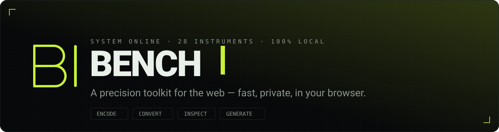

<div align="center">

<a href="https://bench.bozmoz.com"></a>

<p>
  <a href="https://bench.bozmoz.com"></a>
  <a href="#tools"></a>
  <a href="https://nextjs.org"></a>
  <a href="https://react.dev"></a>
  <a href="https://www.typescriptlang.org"></a>
  <a href="https://tailwindcss.com"></a>
  <a href="#license"></a>
</p>

**A growing collection of fast, private developer utilities — every tool runs 100% in your browser.**<br/>
No uploads. No accounts. No rate limits. Only anonymous page-view counts.
<br/>
**Live at [bench.bozmoz.com](https://bench.bozmoz.com)**

</div>

---

Bench is the kind of small tools you reach for a dozen times a day — encode something, inspect some JSON, turn a few images into a GIF, convert a date into the Hijri calendar — all in one cohesive, keyboard-driven workbench. Everything is computed locally with a registry-driven architecture, so adding a tool is a one-file change.

## Highlights

- 🔒 **Private by default** — tools execute entirely in the browser (Web Workers / WASM where needed). Your data is never uploaded or logged; only anonymous page views are counted (no query strings, no ad features).
- 🔗 **Shareable by URL** — inputs and settings live in the address bar (or a compressed hash for large payloads), so any result is one copy-paste away. Share links longer than 2,000 characters are shortened automatically.
- ⌘ **Minimum-action access** — a global **⌘K** command palette searches and jumps to any tool from anywhere.
- 🔎 **SEO / GEO / LLM-ready** — static generation, per-tool metadata, JSON-LD (`SoftwareApplication`, `BreadcrumbList`, `FAQPage`), `sitemap.xml`, `robots.txt`, and machine-readable [`/llms.txt`](https://llmstxt.org) + `/llms-full.txt`.
- 🧩 **Registry-driven** — one typed array generates routes, navigation, command palette, sitemap, OG images, and AI-discovery files.
- 🧰 **Built like a tool, not a landing page** — every tool is one click away in a persistent index, each page has a single primary Share action, and the light/dark palette follows your system.

## Tools

> 46 tools across 10 categories — and counting.

| Category | Tools |
| --- | --- |
| **Text & Encoding** | Text Transformer (45+ transforms) · Base64 · URL · HTML Entities · Case Converter · EIP-55 Checksum · Full-width ↔ Half-width · Katakana ↔ Hiragana · ASCII Table & Codes · Finglish → Farsi · Romaji ↔ Hiragana / Katakana · Markdown Editor |
| **JSON & Data** | JSON Viewer & Formatter (tree, search, validate, convert) · JSON Schema Validator & Designer |
| **Image & Media** | GIF Maker · Image Converter (PNG/JPG/WebP + resize) · Base64 Image · Content Credentials (C2PA) & SynthID Inspector · Slow-mo → Normal Speed Video |
| **Crypto & Hashing** | Hash Generator (MD5 · SHA-1/256/384/512 · SHA-3 · Keccak) · ECDSA Sign & Verify · Wallet Generator (BIP39 / BIP44) |
| **Generators** | UUID & NanoID · QR Code (styled) · Password Generator · Random Generator · Lucky Draw |
| **Time & Date** | Unix Timestamp · Date Converter (12 calendars + timezones) · Day Calculator · Cron Parser & Builder |
| **Color & Design** | Color Converter (HEX/RGB/HSL/OKLCH/CMYK · picker · gradients · contrast) · Color Palette Generator (OKLCH harmonies, scales, from image) |
| **Math & Units** | Loan & Mortgage Simulator · Number Base Converter · Unit Converter |
| **Web & Dev** | Regex Tester · Diff Checker (line/word/char, side by side, patches) · JWT Decoder, Verifier & Encoder · URL Shortener (server-backed, best-effort) |

Adding a tool is a one-file change — see the add-tool skill in `.claude/skills`.

Each release bumps `version` in `package.json`; the footer shows it with the deployed commit so you can tell which release a page is.

## Tech stack

| | |
| --- | --- |
| **Framework** | [Next.js 16](https://nextjs.org) (App Router, React 19, RSC) + Turbopack |
| **Language** | TypeScript |
| **Styling** | [Tailwind CSS v4](https://tailwindcss.com) with CSS-variable theming |
| **URL state** | [nuqs](https://nuqs.47ng.com) + [lz-string](https://github.com/pieroxy/lz-string) for large payloads |
| **Command palette** | [cmdk](https://cmdk.paco.me) |
| **Motion** | [Motion](https://motion.dev) |
| **Notable libs** | `gifenc` (GIF encoding in a Web Worker), `qr-code-styling`, `@noble/curves` + `@scure/bip39/bip32` (wallets), `js-sha3` / `js-md5` (hashing) |
| **Hosting** | [Vercel](https://vercel.com) — static + edge, free on the Hobby plan |

## Getting started

```bash
git clone https://github.com/nobari/bench.git
cd bench
pnpm install
pnpm dev          # http://localhost:3000
```

Other scripts:

```bash
pnpm build        # production build (static-generates every tool page)
pnpm start        # serve the production build
pnpm lint         # eslint
```

> Requires Node.js 20+ and [pnpm](https://pnpm.io). The repo uses pnpm, but npm/yarn work too.

## Adding a tool

The whole app is generated from one registry, so a new tool is a single entry plus a widget:

1. **Logic** — a pure, SSR-safe module under `lib/tools/…`.
2. **Widget** — a `"use client"` component in `components/widgets/` that reads/writes shareable state via `nuqs`. Register it in `components/tool-mount.tsx`.
3. **Registry** — append a `ToolDef` to `lib/tools/registry.ts` with its slug, copy, keywords, FAQ and which widget to mount.

That's it — the route, command-palette entry, sitemap, `llms.txt`, JSON-LD and related-tool links all update automatically. A full walkthrough lives in [`.claude/skills/add-tool/SKILL.md`](.claude/skills/add-tool/SKILL.md).

## Project structure

```
app/                 # App Router: home, [category], [category]/[tool], sitemap, robots, llms.txt
components/
  widgets/           # the interactive tool UIs (lazy-loaded, client-side)
  …                  # command palette, header/footer, shared primitives
lib/
  tools/
    registry.ts      # ← the single source of truth for every tool
    categories.ts    # category definitions + accent colors
    …                # pure logic per domain (text, json, color, crypto, math, time)
  seo.ts             # JSON-LD builders
docs/                # banner + assets
```

## Environment variables

Copy `.env.example` to `.env.local`. All are optional — the app runs fully without them.

| Variable | Purpose |
| --- | --- |
| `NEXT_PUBLIC_SITE_URL` | Overrides the canonical URL for metadata/sitemap/OG. Production defaults to `https://bench.bozmoz.com`; previews use their own host. |
| `NEXT_PUBLIC_GA_ID` | Google Analytics 4 measurement ID. Unset = no analytics. Page views are sent without query strings; DNT/GPC browsers are excluded. |
| `GITHUB_REPO` | `owner/repo` that receives "Suggest a tool" issues. |
| `GITHUB_TOKEN` | Fine-grained PAT with **Issues: write**. Without it, the suggest form falls back to opening a prefilled GitHub issue. |

## Deploy

[](https://vercel.com/new/clone?repository-url=https://github.com/nobari/bench)

Import the repo into Vercel — it auto-detects Next.js. Every tool page is statically generated and served from the edge; the only server code is the `llms.txt` route handlers and the suggest Server Action. Set the env vars above in the project settings if you want the GitHub-issue integration.

## Contributing

Missing a tool? Open an issue with the **`tool-suggestion`** label (or use the in-app **Suggest a tool** form). PRs that add a tool via the registry are very welcome — see [Adding a tool](#adding-a-tool).

## License

[MIT](LICENSE) © [Sadegh Nobari](https://github.com/nobari)

<div align="center"><sub>Built for the browser · 100% client-side · 0 bytes uploaded</sub></div>
